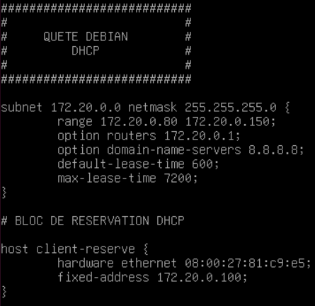
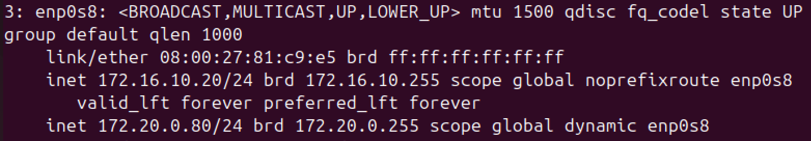
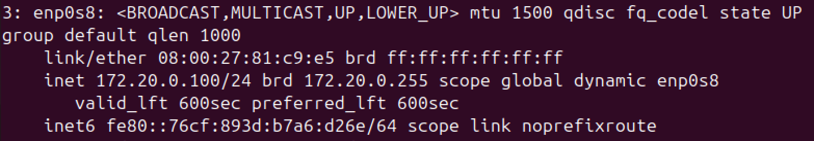
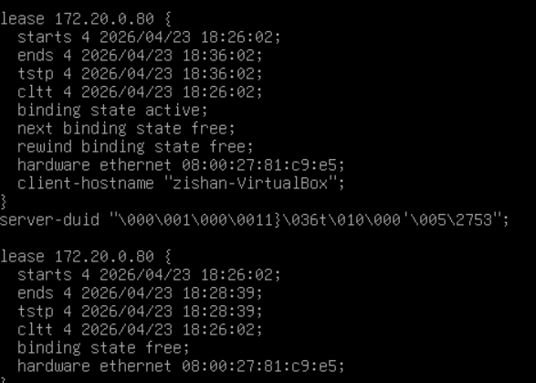

# quete_dhcp_debian -- MERCI LES CORRECTEURS {{ DANKE SCHEUNE }}

# La configuration DHCP du serveur :

# La configuration IP du 1er client:

# La configuration IP du second client :

# L'affichage de la fenêtre de reservation sur le serveur :

